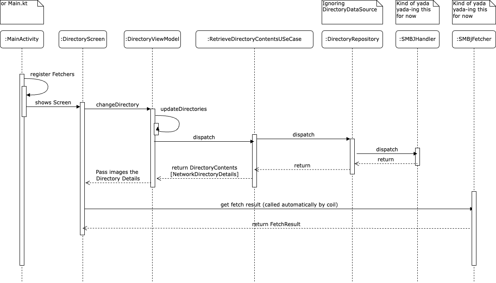

# Image Loading 



## Coil

For images FotoPresenter uses [Coil](https://coil-kt.github.io/coil/), an image loading library. 
Coil is mainly used for loading images from URL, however it has the feature to load images using a [`Fetcher`](https://coil-kt.github.io/coil/image_pipeline/#fetchers). 

This is done in common code in two Fetchers:
* `SMBJFetcher` - takes in a directory
* `SharedImageFetcher` - takes in a shared image

These fetchers are defined in the `MainActivity` or `Main.kt` in the `setSingletonImageLoaderFactory`, then when `AsyncImage` takes in either a `SharedImage` or `NetworkDirectoryDetails` they are automatically handled.

```kotlin
import coil3.compose.AsyncImage
...

// In `MainActivity` for Android or `Main.kt` for Desktop
fun init(){
    setSingletonImageLoaderFactory { context ->
        ImageLoader.Builder(context)
            // Register our Fetcher
            .components {
                add(SMBJFetcher.Factory(Logger))
            }
            ...
            .build()
    }
}

@Compose
fun example(directoryDetails: NetworkDirectoryDetails){
    LoadingAsyncImage(directoryDetails)
}

@Composable
fun LoadingAsyncImage(
    model: Any?
) {
    // AsyncImage can take anything, then it checks all registered Fetchers to see how to handle the model
    AsyncImage(
        model = model,
        ...
    )

class SMBJFetcher(
    private val directoryDetails: NetworkDirectoryDetails,
    private val imageRepository: ImageRepository,
) : Fetcher {
    // This is called when a NetworkDirectoryDetails is passed to an AsyncImage 
    override suspend fun fetch(): FetchResult? 
        = imageRepository.getFetchResult(...)
}
```

## SMBJFetcher

When the directory screen is shown the `DirectoryViewModel` will call to update the directories contents. This gets the Paths and IDs of the images in the directory.

Those directories are passed to the `AsyncImage` via the `UIState`, and handled by the `SMBJFetcher`.

The `SMBJFetcher` starts out by calling the `ImageRepository`, which gets the Image from the network via the `SMBJHandler`.

The `SMBJHandler`:
* Opens the SMBJ File at the Path
* reads the bytes from the File
* closes the File

Then `getFetchResult` is called, which will return a `FetchResult`, which is required for Coil.
* This will be a `SourceFetchResult` which contains an `ImageSource`

Then that `FetchResult` is sent back to the `SMBJFetcher` where it is handled by Coil.

### Potential updates

I think this can be cleaned up.
1. It doesn't make sense in my mind why you can't use `SourceFetchResult` for both Android and Desktop.
2. The `ImageDirectory` doesn't necessarily need the `val image: SharedImage?`
3. The Image only needs the `path` to work, there's no need to add the entire `NetworkDirectoryDetails`.
4. There doesn't really seem to be a need to have two fetchers? In theory As long as you have the path to the image then that should be all you need.
5. There are a lot of `UseCases` and other classes that could probably be taken out.
