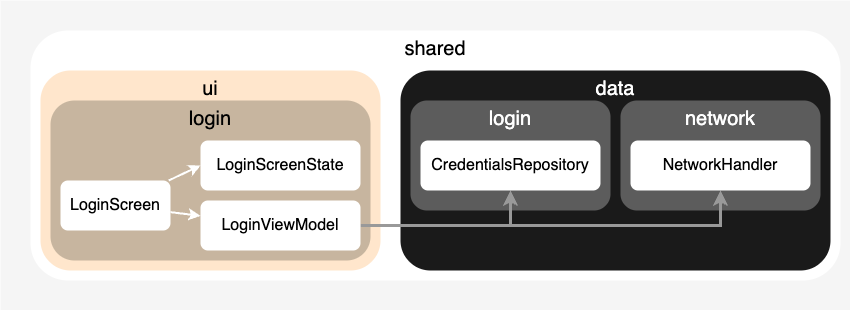
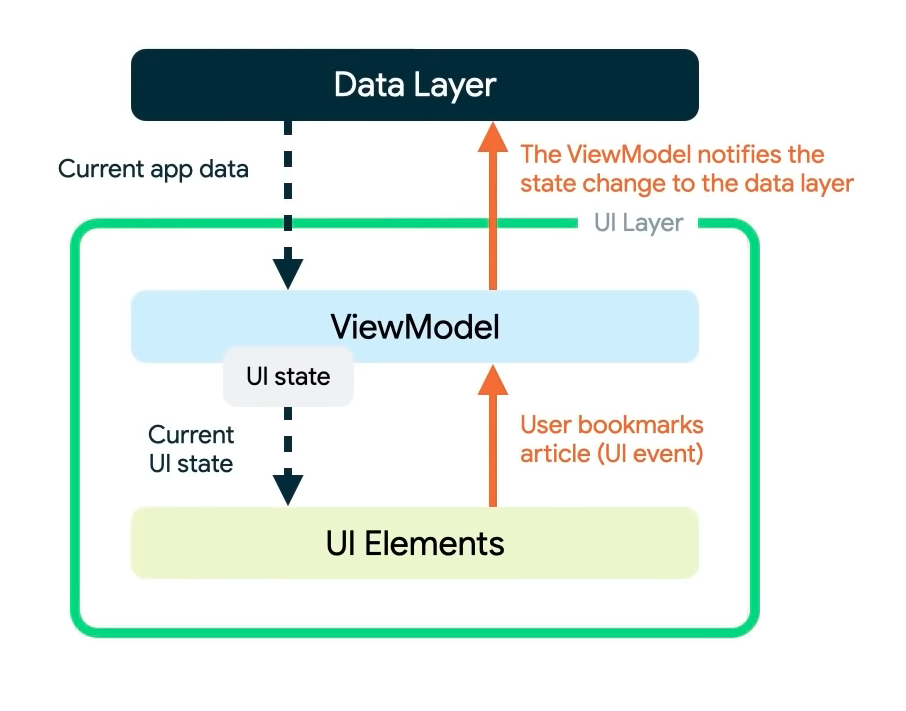

# Architecture

FotoPresenter uses an **MVVM** Architecture(Model-View-ViewModel), which is mostly stored in the shared code.

The project is separated into packages based on the layer, then the usage. For `ui` this is the screen that is shown(i.e. `Login`), for `data` this is the functionality(i.e. `credentials`).

### MVVM Summary

To help clarify how MVVM works in the project, here is some documentation based on the recommended pattern.

In short, there's the UI Layer, which talks to the Domain Layer, which talks to the Data Layer(see below)

This is the recommended architecture from [the android documentation](https://developer.android.com/topic/architecture), which can be used in common code as well. While there are many different architectures in iOS (MVC, VIPER, etc) a lot of developers are moving towards MVVM to work with SwiftUI.

## UI Layer

`com.kevinschildhorn.fotopresenter.ui`

Contains:
* **UI elements**, which are in the platform layers(Using Compose and SwiftUI)
* **ViewModels**, which are in the `commonMain` sourceset
* **UiState**, which are data classes in the `commonMain` sourceset that hold the state of the UI to be displayed (text, button states, etc)

## Domain Layer

`com.kevinschildhorn.fotopresenter.domain`

Contains **Use Cases** to reuse business logic. Note that it is generally recommended that you don't need `Use Cases` in a smaller application, but for clean architecture and wanting to work with `Uses Cases` I have added them to this project. These Use cases live in the `commonMain` sourceset.

## Data Layer

`com.kevinschildhorn.fotopresenter.data`

Contains:
* **Data Sources**, which are in the `commonMain` sourceset
* **Repositories**, which live in the `commonMain` sourceset
* **Data** used in the sources and repositories, which are generally data classes

### Example of Data Flow

The general hierarchy of the app is:
`UI -> ViewModel -> UseCase -> Repository -> DataSource`
