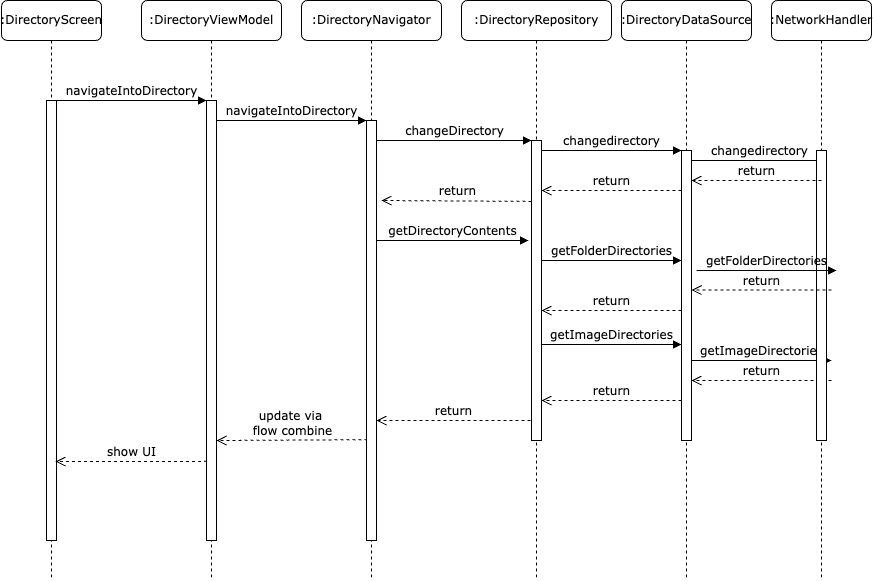

# Directory Navigation

Navigation is in its own file `DirectoryNavigator` in order to prevent the `DirectoryViewModel` from getting bloated. It is called from the `ViewModel`, and updates from the `Navigator` come back as a `StateFlow` and is combined with the `UiState` of the `ViewModel`.
