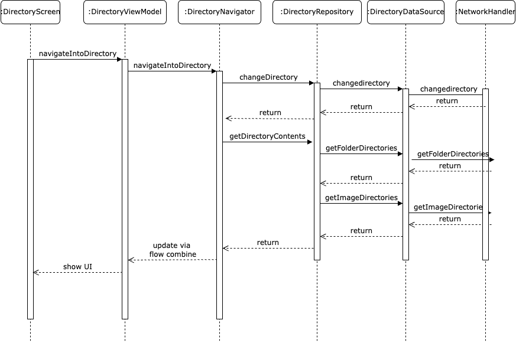

# Directory System Documentation

This document describes the directory system implementation in the FoToPresenter application, which allows users to navigate an FTP/SMB servers.

## Overview

While the Directory Screen initially sounds like a straightforward screen, there's actually a lot going on here. This doc will cover what happens and how.

This Screen handles:
* Navigating your FTP Server
* Showing large previews of the images
* TODO: Editing Image Metadata
* TODO: Adding Folders to a playlist
* TODO: Adding Images to a playlist
* TODO: Starting a Slideshow from a Folder

These are handled using short clicks and long clicks on mobile, and left and right clicks on desktop.

### Status
- [X] UI
- [X] ViewModel
- [X] Use Cases Work
- [ ] Unit Tests
- [ ] UI Tests

## Use Cases
* [Edit Image Metadata Use Case](UseCases/EditImageMetadataUseCase.md)
* [Navigate Directories Use Case](UseCases/NavigateDirectoriesUseCase.md)
* [Preview Image Use Case](UseCases/PreviewImageUseCase.md)

## Directory Navigation

This is done using the `DirectoryNavigator`. 
The `DirectoryViewModel` passes commands to the Navigator which then handles these states and contains the current state as a Flow.
Navigation is in its own file `DirectoryNavigator` in order to prevent the `DirectoryViewModel` from getting bloated.
It is called from the `ViewModel`, and updates from the `Navigator` come back as a `StateFlow` and is combined with the `UiState` of the `ViewModel`.

This handles clicking on Folders (and the navigation bar), while clicking on images is handled by the next part

## Image Previews

Image previews appear if the user clicks on an image, which is shown in an overlay. This overlay shows an image and supports moving to next and previous image.
The state of the preview is handled by the `ImagePreviewNavigator`. This handles the current image the user is looking at, and handles changes in which image is shown.

## Editing Image Metadata

