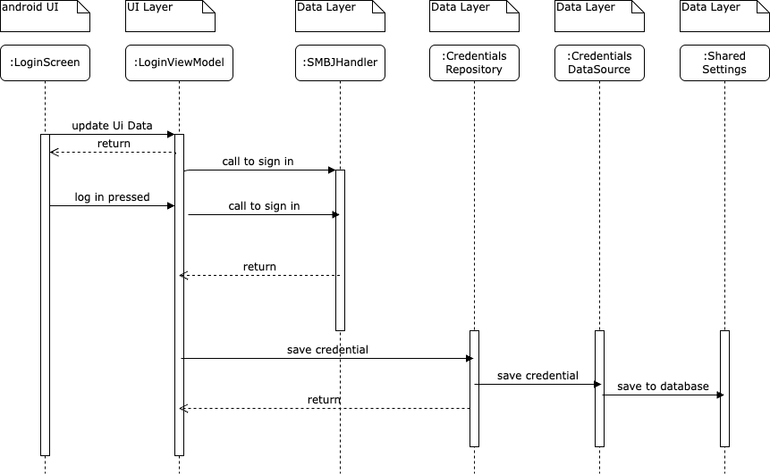

# Login System Documentation

This document describes the login system implementation in the FoToPresenter application, which allows users to connect to FTP/SMB servers.

## Overview

The login system consists of several key components that work together to provide a secure and user-friendly authentication experience:

1. **LoginScreen**: The main UI component that displays the login form
2. **LoginViewModel**: Manages the login state and business logic
3. **LoginCredentials**: Data class that holds the authentication information
4. **CredentialsRepository**: Handles credential persistence
5. **NetworkHandler**: Manages the actual server connection

## Components

### LoginScreen

`ui.screens.login.LoginScreen`

The `LoginScreen` is a Compose UI component that provides:
- Input fields for hostname, username, password, and shared folder
- Auto-connect checkbox option
- Login button with loading state
- Error handling and display
- Link to QNAP NAS setup guide

### LoginViewModel

`ui.screens.login.LoginViewModel`

The `LoginViewModel` manages the login process and includes:
- State management using `LoginScreenState`
- Credential validation
- Auto-login functionality
- Connection attempt handling
- Error state management

### LoginCredentials

`data.login.LoginCredentials`

The `LoginCredentials` data class contains:
- `hostname`: Server address
- `username`: User's username
- `password`: User's password
- `sharedFolder`: Target folder path
- `shouldAutoConnect`: Auto-connect preference

### CredentialsRepository

`data.repositories.CredentialsRepository`

The `CredentialsRepository` handles:
- Loading saved credentials
- Saving new credentials
- Managing auto-connect settings
- Clearing credentials when needed

### NetworkHandler

`data.network.NetworkHandler`

The `NetworkHandler` interface and its implementations:
- Establish connection to the server
- Handle authentication
- Manage session state
- Provide directory access

## Login Flow

1. User enters credentials in the login form
2. `LoginViewModel` validates the input
3. On login button press:
   - UI state changes to loading
   - `NetworkHandler` attempts connection
   - On success: credentials are saved and user is redirected
   - On failure: error is displayed to user

## Auto-Connect Feature

The application supports automatic connection on startup:
1. Checks for saved credentials
2. Verifies auto-connect is enabled
3. Attempts connection using saved credentials
4. Proceeds to main screen on success

## Security Considerations

- Credentials are stored securely using platform-specific storage
- Passwords are not displayed in plain text
- Connection errors are handled gracefully
- Auto-connect can be disabled for security

## Error Handling

The login system handles various error scenarios:
- Invalid credentials
- Network connectivity issues
- Server access problems
- Invalid shared folder paths

## Related Components

- `DirectoryViewModel`: Handles post-login navigation
- `NetworkHandler`: Manages server connections
- `CredentialsDataSource`: Handles credential storage
