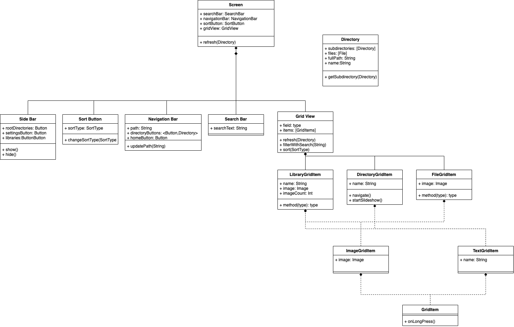
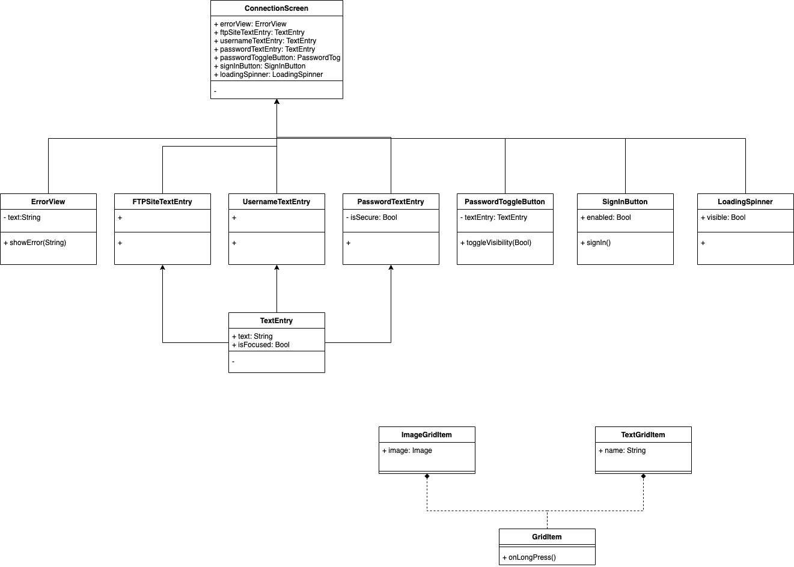

# UML Diagrams

This directory contains UML diagrams that document the architecture and design of the FoToPresenter application.

## Available Diagrams

### 1. Navigation Flow

This diagram illustrates the navigation flow within the application, showing how different screens and components are connected and how users navigate between them.

### 2. Architecture Flow

This diagram shows the high-level architecture of the application, including:
- Component relationships
- Data flow
- Core system modules
- Platform-specific implementations

### 3. Connection Flow

This diagram details the connection handling in the application, including:
- Network connections
- File system interactions
- Data synchronization
- Connection state management

## Source Files

The diagrams are created using [draw.io](https://app.diagrams.net/) and are available in both `.drawio` (source) and `.png` (rendered) formats:

- `FotoNavigationUml.drawio` / `FotoNavigationUml.drawio.png`
- `ArchitectureFlow.drawio` / `ArchitectureFlow.drawio.png`
- `FotoConnectionUml.drawio` / `FotoConnectionUml.drawio.png`

## Viewing the Diagrams

You can view these diagrams in several ways:
1. Open the PNG files directly in any image viewer
2. Use [draw.io](https://app.diagrams.net/) to open and edit the `.drawio` files
3. View them in GitHub's web interface which will render the PNG files automatically

## Updating the Diagrams

When updating these diagrams:
1. Edit the `.drawio` files using draw.io
2. Export to PNG format
3. Commit both the source and rendered files
4. Update this README if the diagram purposes or structure change significantly
